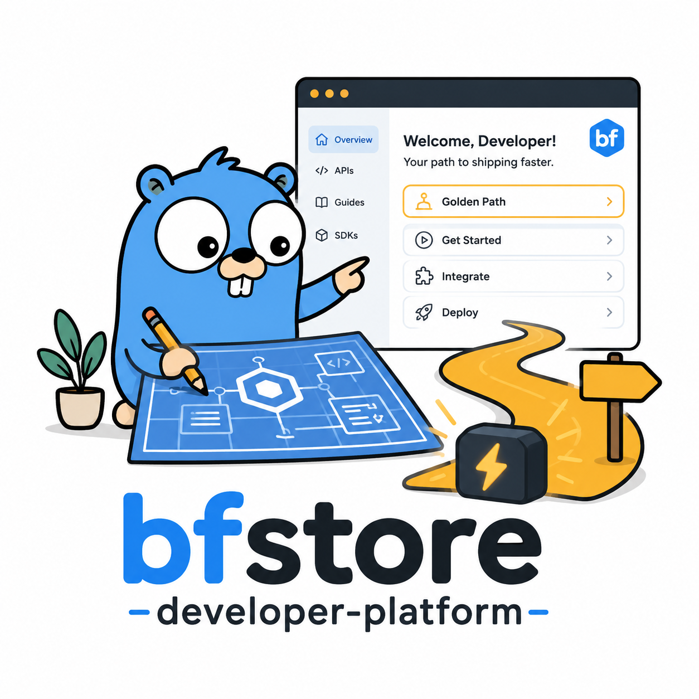

# bfstore Developer Platform



Developer platform and golden-path tooling for bfstore, including service templates, onboarding workflows, platform standards, local development guidance, and developer experience patterns.

## Repository status

This repository is an early bfstore portfolio repository. It is currently being set up with initial structure, documentation, and direction before implementation work begins.

## Purpose

This repository will hold developer platform assets that make bfstore services easier, safer, and faster to build and operate.

bfstore is a cloud-native ecommerce platform for developer-themed homeware. This repository is part of the wider bfstore portfolio and is intended to demonstrate senior platform engineering, DevSecOps, Kubernetes, cloud infrastructure, and developer experience capability.

## Scope

This repository will cover:

- Golden-path service templates
- Developer onboarding workflows
- Local development standards
- Platform engineering documentation
- Service scaffolding patterns
- Developer experience improvements
- Future internal developer platform experiments

    ## Out of scope

    This repository will not own:

- Application business logic
- Cloud infrastructure state
- Security policy source-of-truth
- Long-lived Kubernetes GitOps state

    ## Repository structure

- `templates/            # Service and documentation templates`
- `docs/                 # Golden paths, onboarding, standards`
- `scripts/              # Developer workflow helpers`
- `examples/             # Example generated services or workflows`
- `platform-catalogue/   # Future service catalogue experiments`

    ## Initial roadmap

- [ ] Define first bfstore service golden path
- [ ] Create service README and ADR templates
- [ ] Add local development onboarding flow
- [ ] Add standard observability/logging guidance links
- [ ] Explore future Backstage-style catalogue integration

    ## Engineering principles

    - Prefer simple, repeatable workflows over clever one-off scripts.
    - Document trade-offs clearly.
    - Keep security and operability visible from the beginning.
    - Design for local development first, then cloud deployment.
    - Treat naming, conventions, and structure as production foundations.

    ## Related bfstore repositories

    ```text
    bfstore
      Main ecommerce microservices platform.

    bfstore-platform-infra
      Cloud infrastructure foundations.

    bfstore-platform-gitops
      Kubernetes GitOps deployment state.

    bfstore-terraform-modules
      Reusable Terraform modules.

    bfstore-security-governance
      Security, compliance, policy, and governance controls.

    bfstore-developer-platform
      Golden paths, templates, and developer experience tooling.
    ```

    ## GitHub topics

    ```text
    developer-platform developer-experience golden-path platform-engineering service-templates backstage devex internal-developer-platform devops bfstore
    ```

    ## Practical rule

    Keep it boring where production matters.
